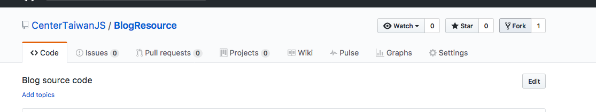

# BlogResource
Blog source code

## Install 

1. Install Hexo

[Hexo Install](https://hexo.io/docs/#Installation)

2. Fork the blog resource



3. 在你的Repo中 clone BlogResource

```
  $ git clone git@github.com:${yourname}/BlogResource.git
```

3. create new post

```
  $ hexo new post ${Title}
```

4. 寫文章

5. commit

```
  $ git commit -am '名字:日期:文章抬頭'
```

6. Push

```
git push origin master
```

7. Pull Request

